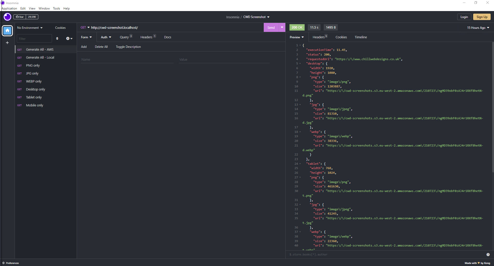

# Insomnia Atom Theme
An Insomnia theme based on the Atom text editor

## Usage

#### Install

1. In Insomnia, go to _Application_ and select _Preferences_
2. Click on _Plugins_
3. Paste `@chillwebdesigns/insomnia-plugin-atom-theme` into the package name field
4. Click on _Install Plugin_

#### Activating theme

1. Go to _Application_ and select _Preferences_
2. Click on _Themes_
3. Select any **Atom** color scheme to apply the theme
